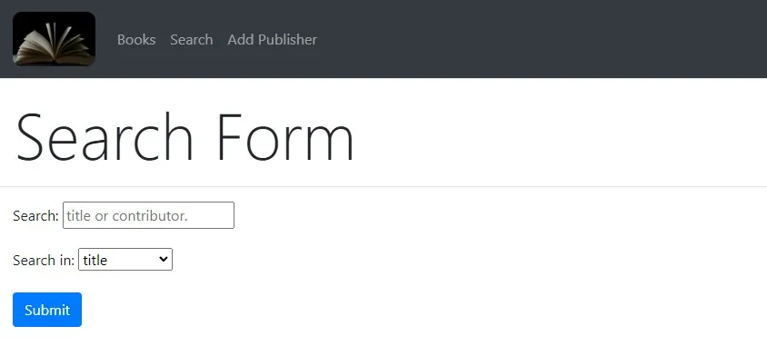
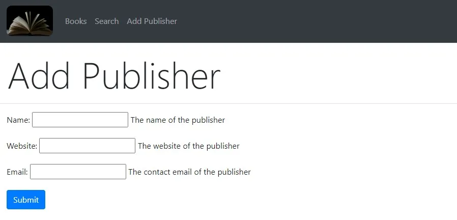

# pybook

This project is built with Python and Django on the Debian OS running on the Windows Subsystem for Linux. The app performs CRUD operations on a SQLite database to retrieve book information and display it in templates. Python 3.9.2, Django 3.1, pip 20.3.4, and WSL2 running Debian was used for this project.






---

## Installation Instructions

1. Clone the repo:

```sh
git clone https://github.com/xiraynedev/pybook.git
```

2. Change directory:

```sh
cd pybook
```

3. Install a virtual environment:

```sh
python3 -m venv .venv
```

4. Activate the virtual environment:

```sh
source .venv/bin/activate
```

5. Install dependencies:

```sh
python3 -m pip install django==3.1 python-decouple
```

6. Create a `.env` file and add any value for the variable `SECRET_KEY=anyvalue`:

```sh
touch .env
```

7. Run the migrate command:

```sh
python3 manage.py migrate
```

8. Add the csv data to the database:

```sh
python3 manage.py loadcsv --csv reviews/management/commands/WebDevWithDjangoData.csv
```

9. Start the dev server:

```sh
python3 manage.py runserver
```
